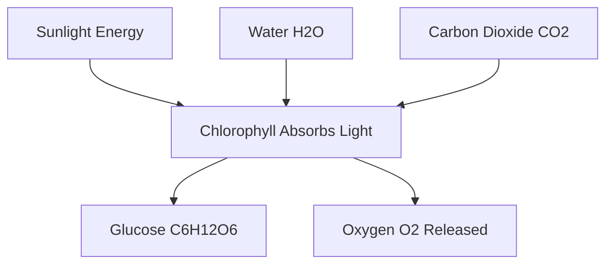
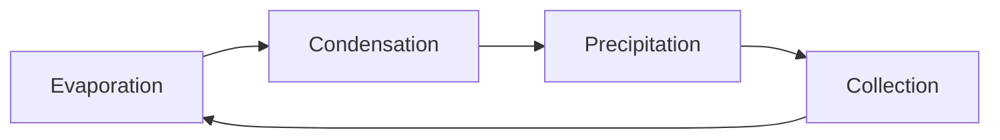
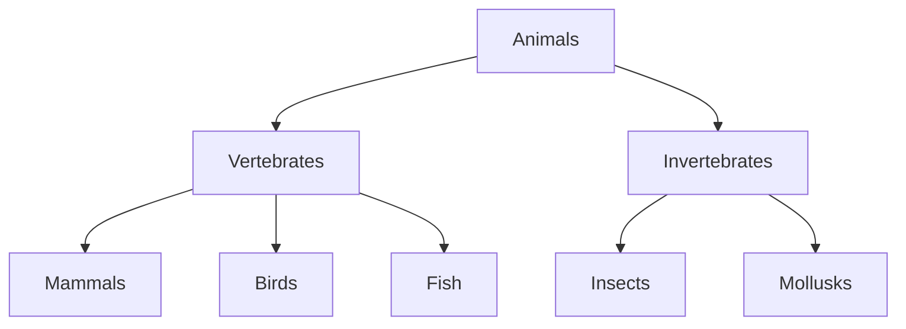
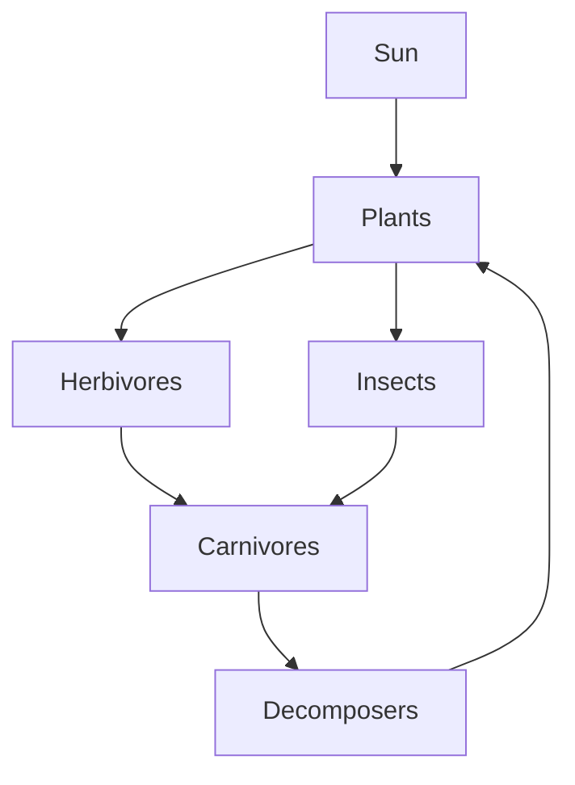
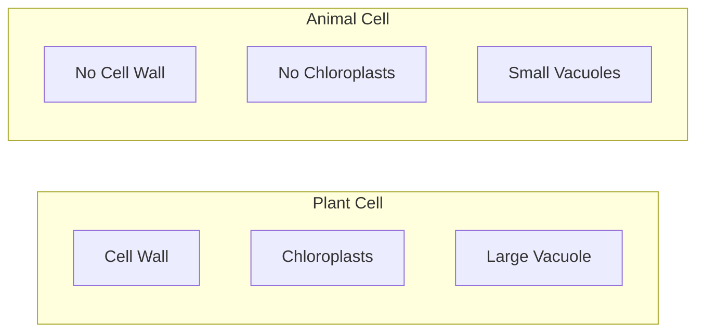
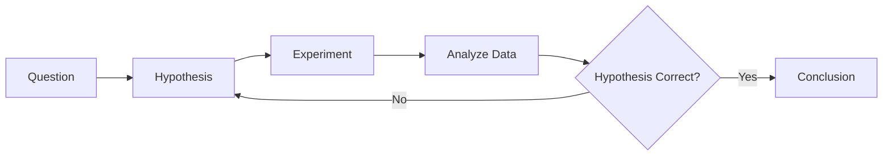

# AI Teacher Diagram Guide

This guide shows when and how the AI Teacher uses diagrams to enhance learning.

## When Diagrams Are Used

The AI Teacher automatically creates visual diagrams for:

### 1. **Processes & Workflows**
Any step-by-step process gets a flowchart:
- Scientific processes (photosynthesis, digestion, etc.)
- Problem-solving steps
- Algorithms and procedures
- Decision-making processes

**Example: Photosynthesis**

### 2. **Cycles**
Repeating processes shown as circular diagrams:
- Water cycle
- Rock cycle
- Life cycles
- Nutrient cycles
- Economic cycles

**Example: Water Cycle**

### 3. **Hierarchies & Classifications**
Tree structures for organizing information:
- Biological classifications
- Family trees
- Organizational charts
- Topic breakdowns

**Example: Animal Classification**

### 4. **Relationships & Connections**
Network diagrams showing how concepts relate:
- Food webs
- Cause and effect
- Concept maps
- Dependencies

**Example: Food Web**

### 5. **Comparisons**
Side-by-side structures:
- Comparing theories
- Pros vs cons
- Before vs after
- Different approaches

**Example: Plant vs Animal Cells**

### 6. **Sequences & Timelines**
Ordered events:
- Historical timelines
- Story sequences
- Experimental procedures
- Development stages

**Example: Scientific Method**

## Subject-Specific Diagram Usage

### Biology
- Cell structures and organelles
- Body systems (circulatory, digestive, nervous)
- Food chains and webs
- Life cycles (butterfly, frog, plant)
- Photosynthesis and respiration
- DNA structure and replication
- Evolution and natural selection

### Chemistry
- Atomic structure
- Chemical reactions
- States of matter transitions
- Periodic table relationships
- Molecular bonding
- pH scale
- Reaction pathways

### Physics
- Force diagrams
- Circuit diagrams
- Energy transformations
- Wave properties
- Motion graphs
- Simple machines
- Light reflection and refraction

### Mathematics
- Problem-solving flowcharts
- Geometric proofs
- Function transformations
- Number relationships
- Algorithm steps
- Set theory diagrams
- Coordinate systems

### History
- Timelines of events
- Cause and effect chains
- Historical connections
- War strategies
- Trade routes
- Political structures
- Cultural influences

### Geography
- Water cycle
- Rock cycle
- Climate systems
- Ecosystem relationships
- Map features
- Population movements
- Economic systems

### Computer Science
- Algorithm flowcharts
- Data structure visualizations
- Program flow
- Network topologies
- Database relationships
- System architectures
- Decision trees

### Language Arts
- Story structure (plot diagram)
- Sentence parsing
- Argument structure
- Character relationships
- Theme connections
- Writing process
- Literary devices

## How to Request Specific Diagrams

Students can ask for diagrams explicitly:
- "Can you show me a diagram of photosynthesis?"
- "Draw a flowchart for solving quadratic equations"
- "Create a timeline of World War II"
- "Show me how the water cycle works with a diagram"

## Diagram Features

All diagrams include:
- Clear labels
- Directional arrows showing flow
- Color-coded sections (when appropriate)
- Logical organization
- Fullscreen viewing option
- Mobile-friendly responsive design

## Tips for Students

1. **Look for diagrams** in every AI Teacher response about processes or relationships
2. **Click fullscreen** to see diagrams in detail
3. **Ask for clarification** if a diagram is unclear
4. **Request additional diagrams** for complex topics
5. **Use diagrams** to study and review concepts

## Tips for Teachers

The AI Teacher is configured to:
- Automatically create diagrams for appropriate topics
- Use diagrams liberally to enhance understanding
- Combine diagrams with step-by-step explanations
- Include diagrams in lesson mode for visual learners
- Provide multiple diagram types for complex topics

## Technical Details

- Diagrams are rendered using Mermaid.js
- All diagrams are interactive and zoomable
- Diagrams work on all devices (desktop, tablet, mobile)
- Diagrams are generated in real-time based on content
- No external images needed - all diagrams are code-based

---

**Remember**: Visual learning is powerful! The AI Teacher uses diagrams extensively to help students understand and remember concepts better.
